# 一、概率公式

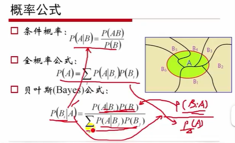

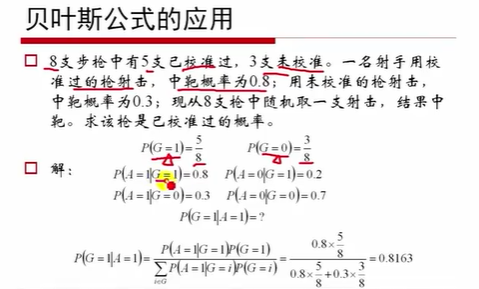

负二项分布

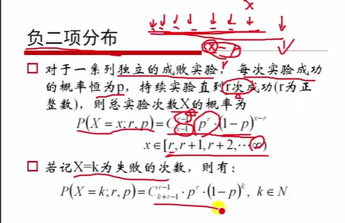

均匀分布

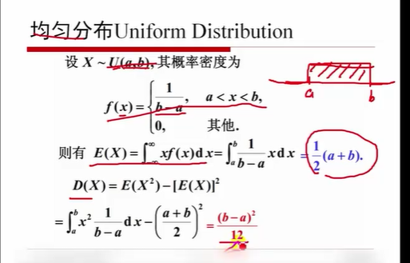

指数分布

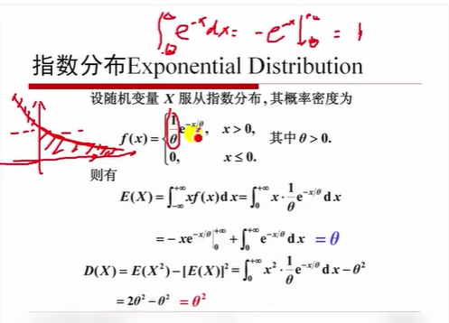

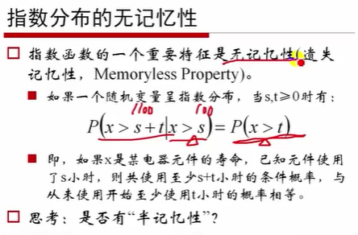

正态分布

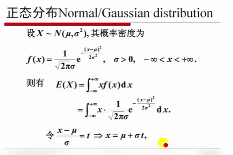

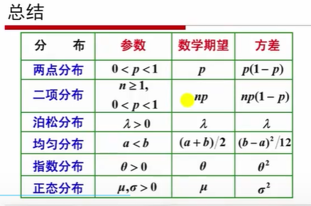

Beta分布

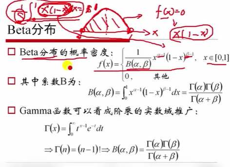
$$
\Gamma(x) = \int_0^\infty t^{x-1}e^{-t}dt
$$
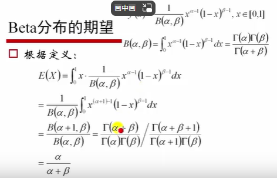

# 概率论

1. 独立事件

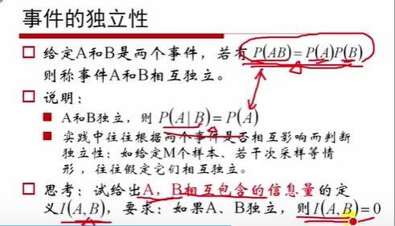

2. 期望的性质

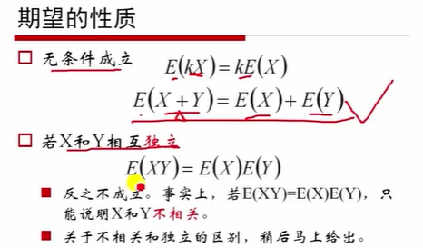

3. 方差

   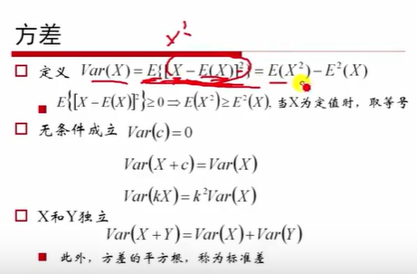

4. 协方差

   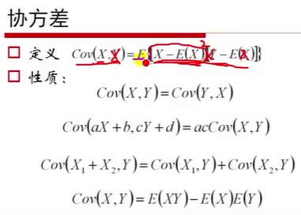

5. 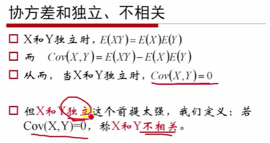

6. 协方差意义

   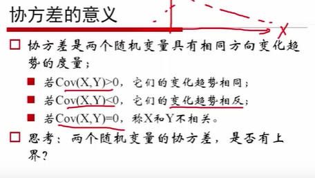

7. 协方差矩阵

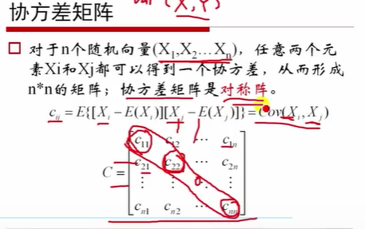

8. 最大似然估计P3结尾