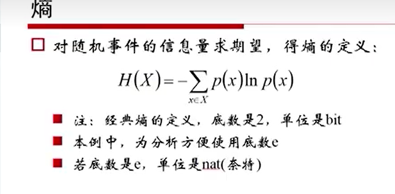
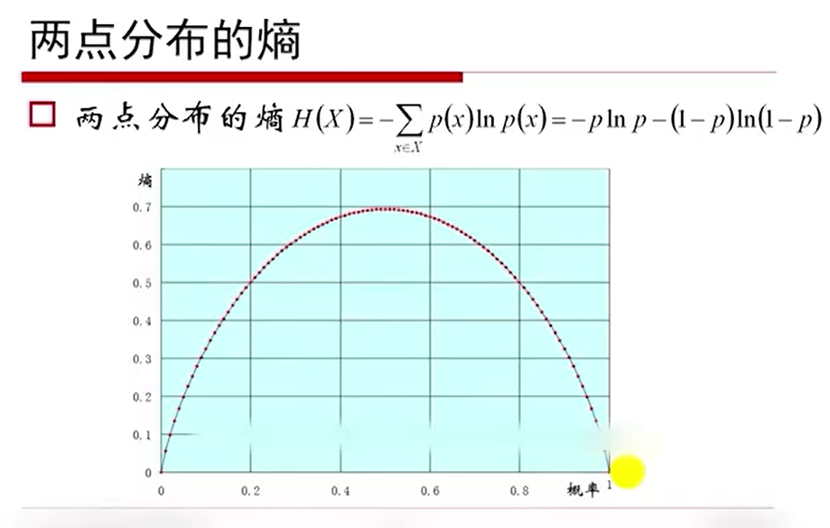
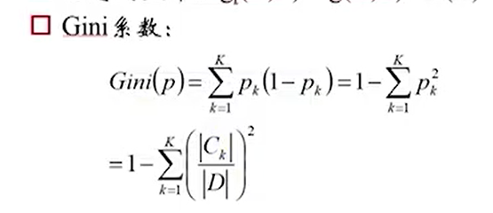
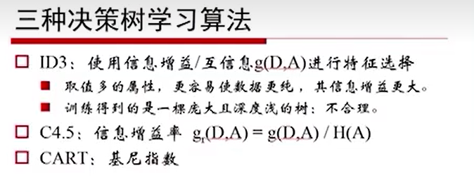
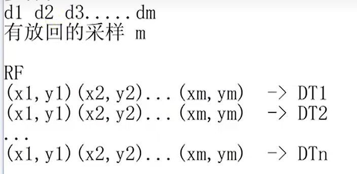
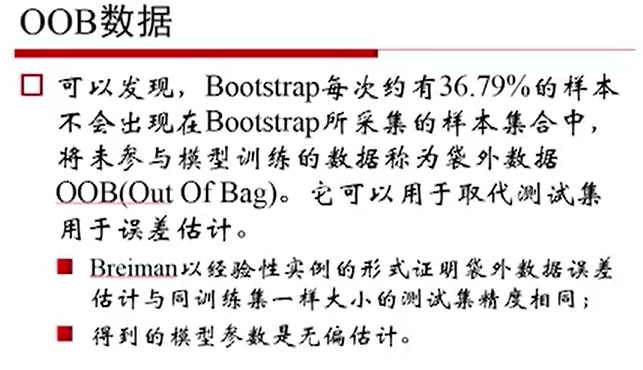
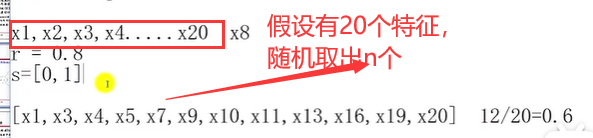
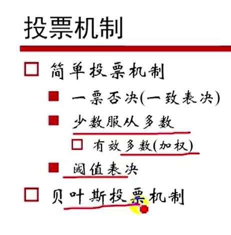
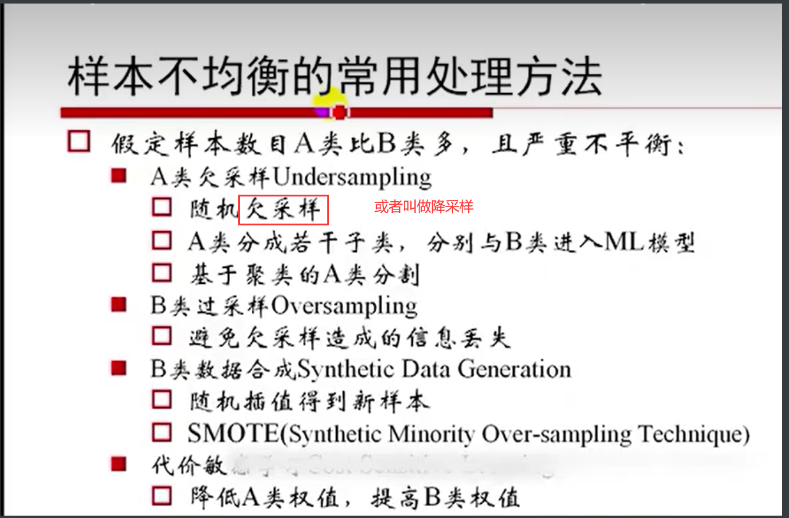
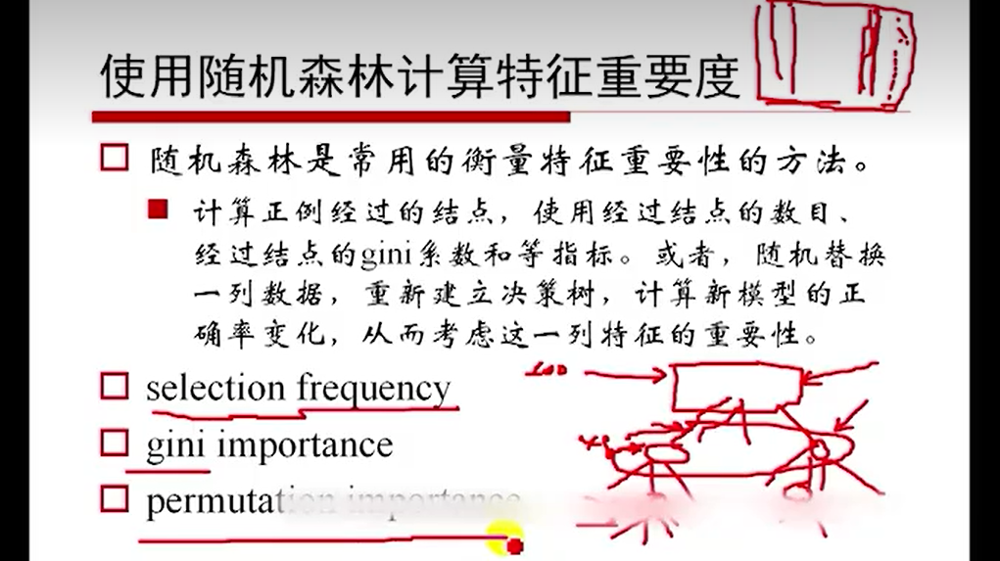

# 一、信息熵

1. 熵（随机事件不确定程度的量）

   

   - 两点的信息熵的公式与图像

     

   - 

2. 联合熵

3. 条件熵

4. 互信息

# 二、决策树算法

1. 信息增益

2. ID3、C4.5、

3. CART

   - Gini系数：

     

   - Gini系数第二定义

4. 三种决策树学习算法

   

5. 随机样本采样
   - OOB数据

# 三、Bagging与随机森林

1. Bagging

   ​	（1） 样本与特征随机取样

   - 样本：有放回的采样

     

   ​	（2）OOB数据

   

   ​	（3）特征做随机采样

   

2. 投票机制

   

3. 样本不均衡处理

   1. 不均衡原因
      1. 采样
      2. 自身

   

4. 使用RF建立样本相似度

5. 随机森林特征重要度

