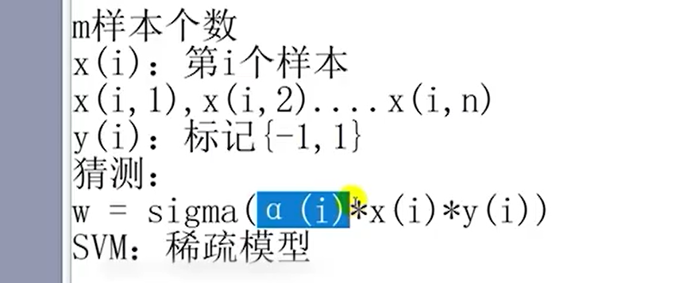
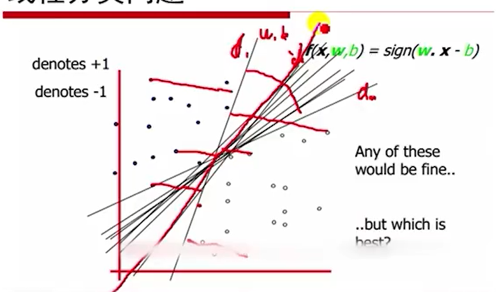
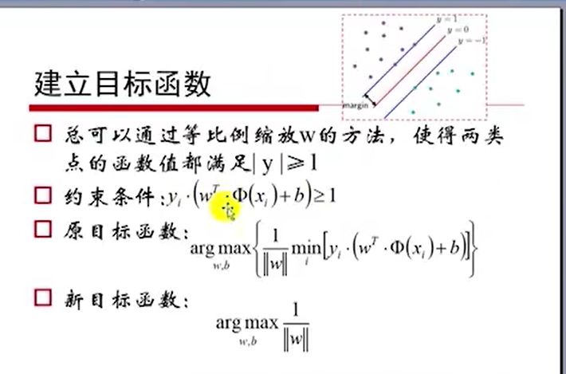
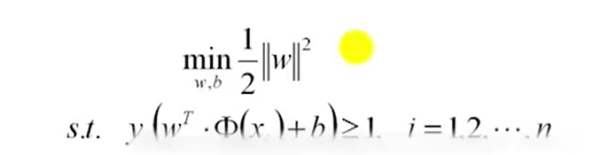
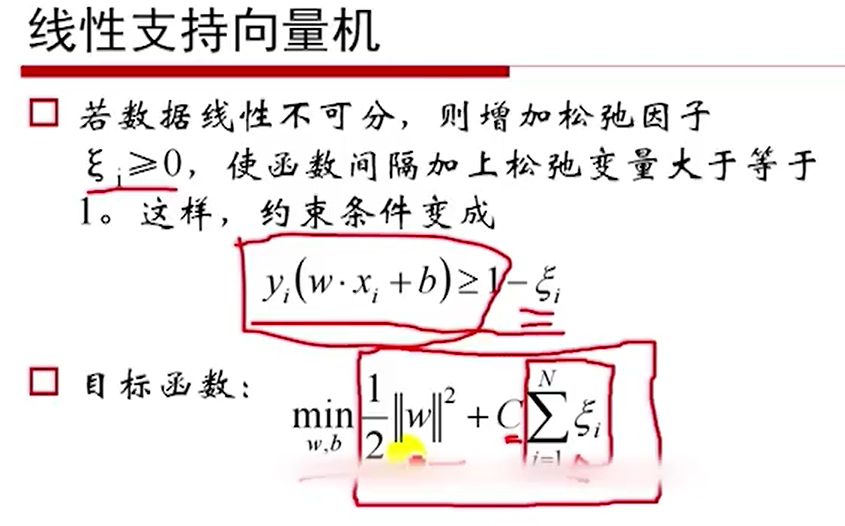
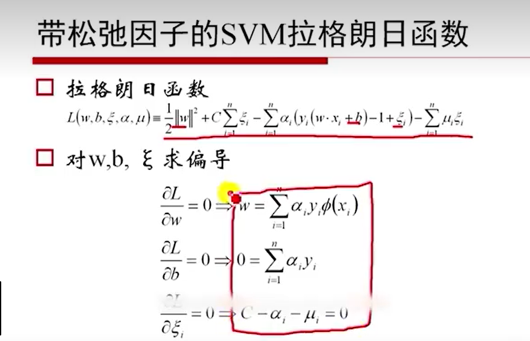
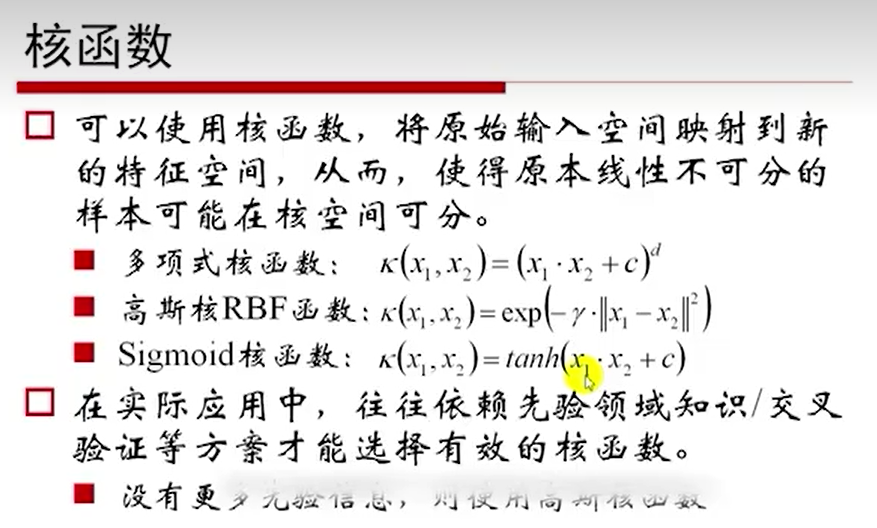
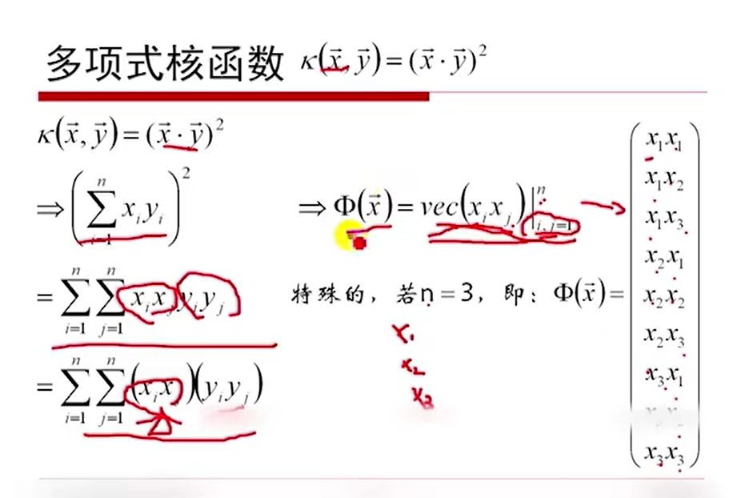

**支持向量机SVM**

# 一、原理和目标

## 1. 线性可分支持向量机

## 2.线性核

C变大，正确率提高，泛化能力在降低，更容易过拟合。C变大，中间地带（过渡带）就会越来越窄。

## 3. 高斯核

$\gamma$：精度（姑且认为是），方差的倒数。

高斯函数就是正态分布函数。

$\gamma$值越大，精度越来越高，衰减速度越快，正确率提高，泛化能力在降低。

# 二、计算过程和算法步骤

## 1. 泛化能力比较

所有样本到直线距离的最小值，最小值记为d，最为该线的衡量指标。m条线，d1~dm中，哪个值最大，就认为哪条线是最优的，泛化能力最强的那条线。

## 2.目标函数简化

​	目标函数再次化简可以看做：

**使用拉格朗日乘子法求解，求解过程在第七个视频55分钟**，[7. SVM_哔哩哔哩_bilibili](https://www.bilibili.com/video/BV15S421o7jX/?p=7&spm_id_from=333.1007.top_right_bar_window_history.content.click&vd_source=68583e193a0e0fab65fa9af13f05d8ba)

## 3. 线性支持向量机

1. 松弛因子与新目标函数

   

2. 求解

3. 

## 4. 损失函数 

# 三、软间隔最大化的含义

# 四、核函数的思想

## 1. 核函数定义 

1. 

## 2.多项式核函数

2. 

# 五、SMO算法的过程