# **聚类**

定义：聚类就是对大量未知标注的数据集，按数据的内在相似性将数据集划分为多个类别，使类别内的数据相似度较大而类别间的数据相似度较小。是一种**无监督**的学习

# 一、相似度

## 1. 相似度/距离计算方法总结

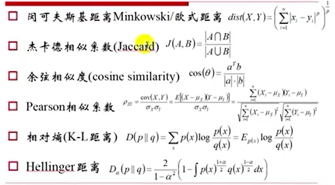

**闵可夫斯基距离**，当p = 2时，就是欧氏距离。当p = 1时，就是曼哈度距离。当$p \to +\infty $，内部除以差值最大的项$|x_k - y_k|$，简化后可以得到$dist = |x_k - y_k|$。

**杰卡德相似系数**：可以理解为：A：推荐的东西，B：需要的东西。比如可以使用商品的流行度和商品的权重做反比。

**Pearson相似系数**：

- $cov(X,Y)$：协方差
- $\sigma_x$是$x$的方差，$\mu_x$代表$x$​的数学期望。

**相对熵**：

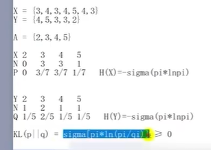

H(x)就是信息熵，相对熵（KL）中p和q只要不是完全相等的情况下，就会大于0。KL不是对称的。

# 二、聚类计算

## 1. k-means（k均值）

1. 是将簇中所有点的均值作为新质心。

   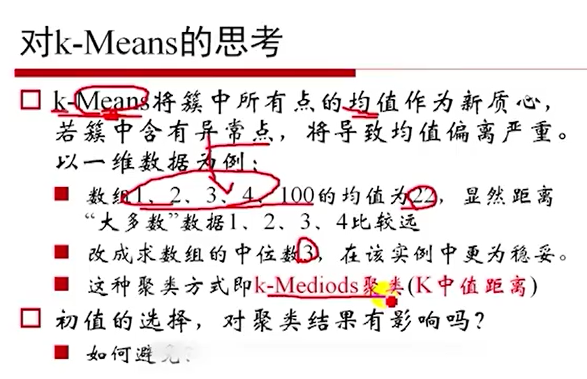

2. k-means是初值敏感的

   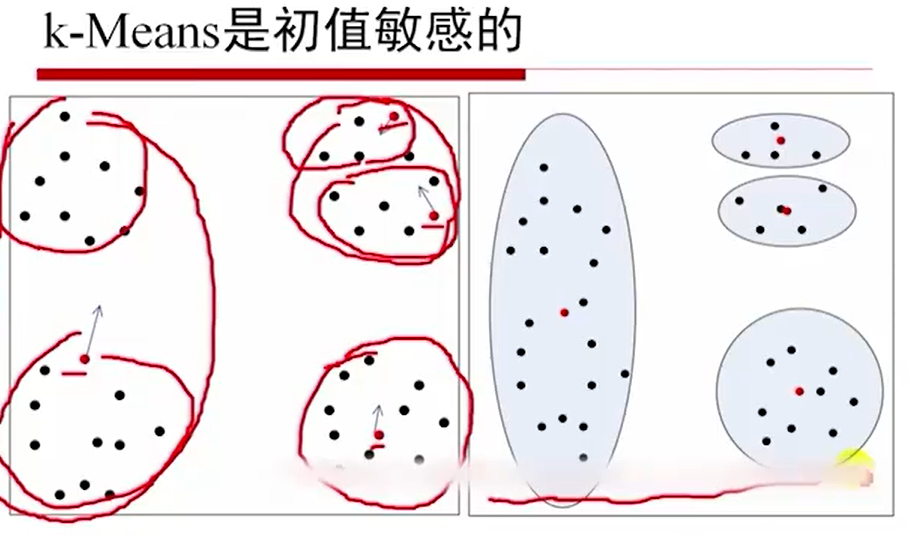

## 2. 二分k-Means

## 3. mini-batch Means

## 4. k-Means聚类方法总结

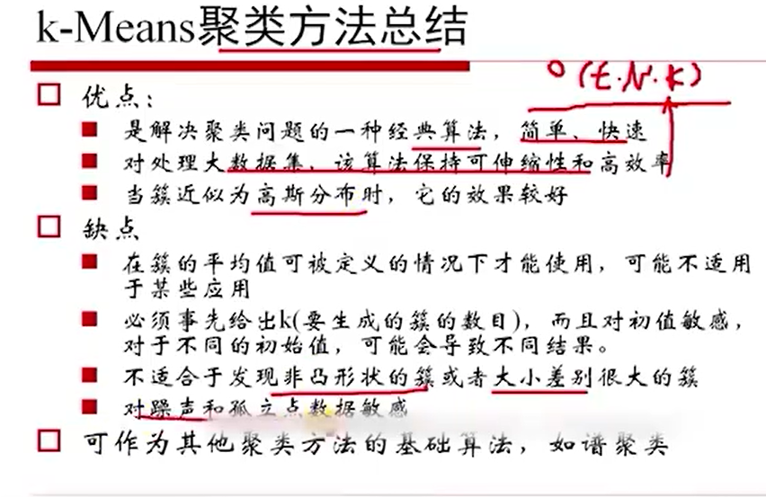

## 5. 轮廓系数

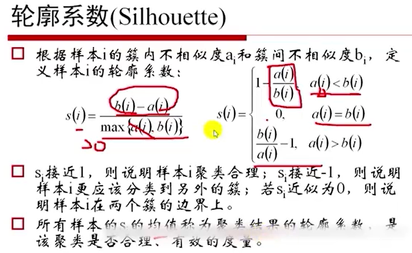

# 三、层次聚类方法

层次聚类方法对给定的数据集进行层次的分解，直到禁种条件满足为止。

**凝聚**的层次聚类：AGNES算法一种自底向上的策略，首先将每个对象作为一个簇，然后合并这些原子簇为越来越大的簇，直到禁个终结条件被满足。

**分裂**的层次聚类：DIANA算法采用自顶向下的策略，它首先将所有对象置于一个簇中，然后逐渐细分为越来越小的簇，直到达到了禁个终结条件。

## 1. AGNES

1. 簇间距离的不同定义
   - 最小距离
     - 两个集合中最近的两个样本的距离
     - 容易形成链状结构
   - 最大距离complete
     - 两个集合中最远的两个样本的距离
     - 若存在异常值则不稳定
   - 平均距离average
     - 两个集合中样本间两两距离的平均值
   - 方差Ward
     - 使得簇内距离平方和取小，族间平方和取最大。

2. DBSCAN

一个比较有代表性的基于密度的聚类算法。与划分和层次聚类方法不同，它将簇定义为**密度相连的点的最大集合**，能够把具有足够高密度的区域划分为簇，并可在有“噪声”的数据中发现任意形状的聚类。

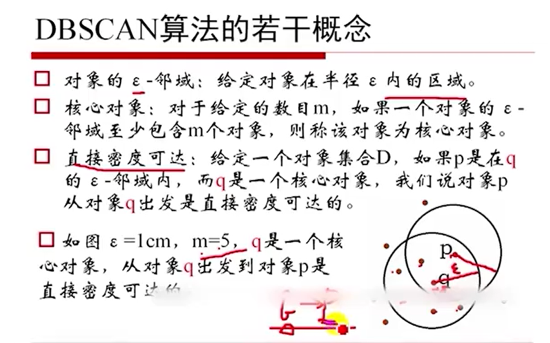

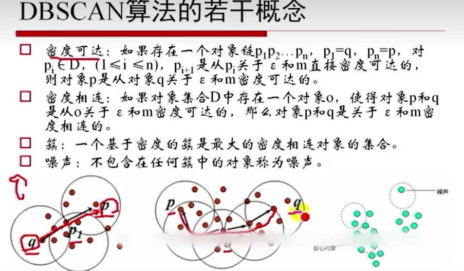

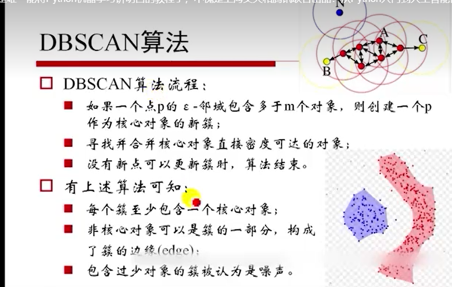

3. 密度最大值聚类

   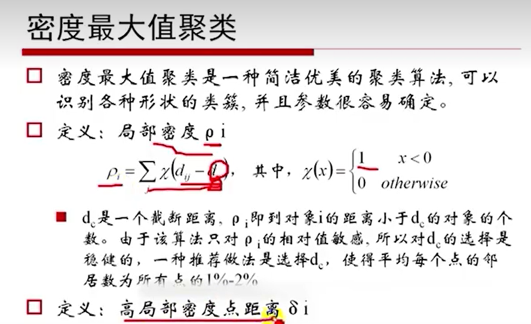

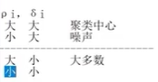

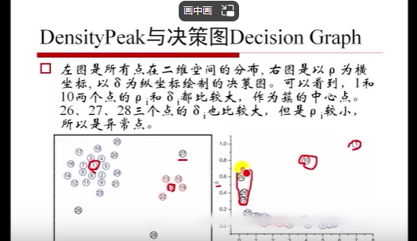

## 2.*谱聚类

