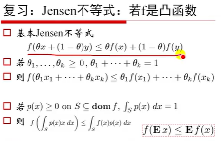
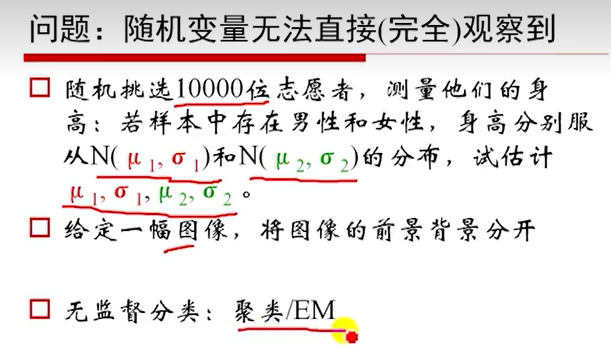
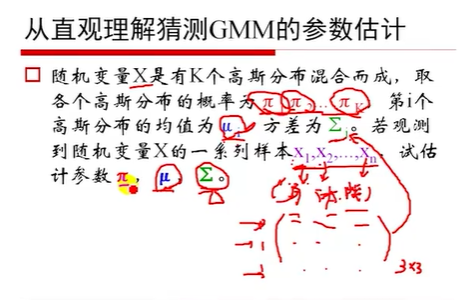
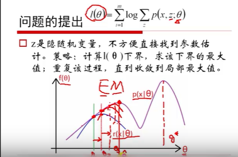

# **EM算法**

EM算法，期望最大化模型

## 一、复习

### 1. Jensen不等式

1.

凸函数：曲线的两个点连线在曲线**上方**
$$
\theta_1,\theta_2,\theta_3,...\theta_1，都是>0，且<1。\\
\theta_1+\theta_2+\theta_3+,...+\theta_1=1，可以看做是一组概率。\\
x\ \ \ 1\ \ \ 2 \ \ \ 3 \\
p \ \ \theta_1\ \theta_2 \ \theta_3
\\
E(x) = \sum_{i=1}^k{\theta_ix_i}
\\
原式化简为：f(E(x)) \leq Ef(x)
$$

高斯分布的概率密度函数：
$$
f(x) = \frac{1}{\sqrt{2\pi \sigma}}{e^\frac{(x-\mu)^2}{2\sigma^2}}\\
\\
\sigma:表示标准差\\
\mu:表示期望
$$

## 二、EM

### 1.问题

 
