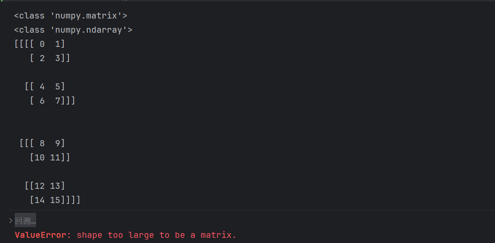
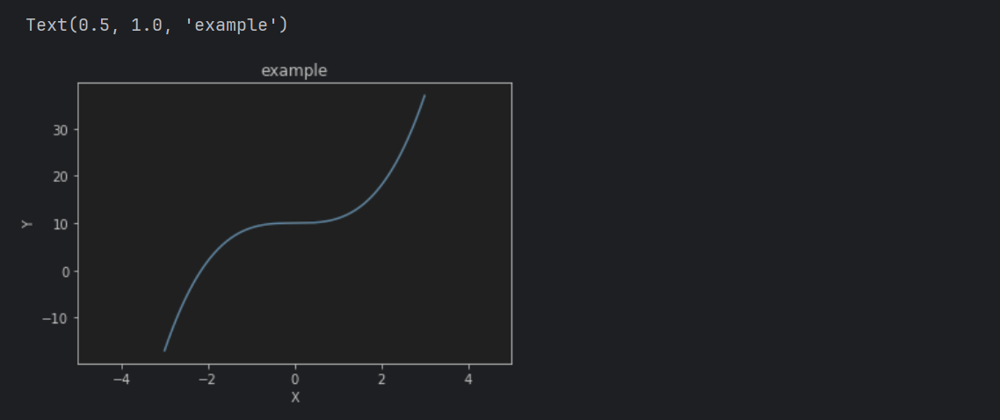
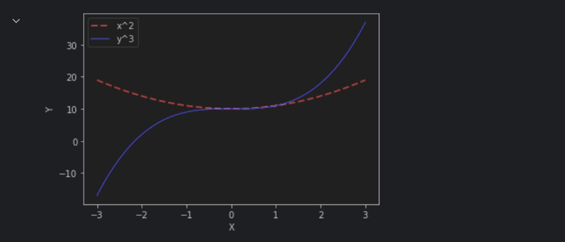
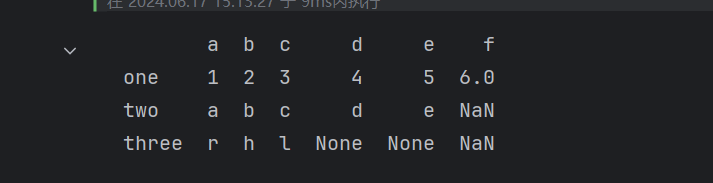

# 一、标准数据类型

# 二、复杂一点的函数

1. map函数

   ```python
   sequence = [1,2,3,4]
   list(map(lambda x:x**2,sequence))
   ```

2. filter过滤函数

   ```python
   list(filter(lambda x:x%2==0,sequence))
   ```

3. enumerate函数：对每个元素进行标号，默认从0开始标号

   ```python
   b = ["a","b","c","d","e","f","g","h","i","j"]
   list(enumerate(b))
   ```

4. zip函数：匹配函数（只匹配到最短的一个结束）

   ```python
   c = [10,20,30,40,50,60,70,80,90]
   list(zip(sequence,b,c))
   ```

5. reduce函数

   ```python
   from functools import reduce
   reduce(lambda x,y:x+y,sequence)
   ```

# 三、print函数

1. 简单进度条实现

   ```python
   import sys
   import time
   for i in range(101):
       time.sleep(0.1)
       sys.stdout.write("["+str(i)+"/100] "+"#"*i+"\r")  #\r：从头开始写
   ```

   print实现：

   ```python
   import time
   for i in range(101):
       time.sleep(0.1)
       print("\r["+str(i)+"/100] "+"#"*i,end = " ",flush=True)  #\r：从头开始写
   ```

# 四、numpy

1. 生成单位矩阵 

   ```python
   import numpy as np
   a = np.eye(3)
   a
   ```

2. 矩阵形状

   ```python
   c = np.matrix(range(16))
   print(c,c.shape,sep='\n')
   c1 = c.reshape(4, 4)
   print(c1,c1.shape,sep='\n')
   ```

3. 转置矩阵

   ```python
   print(c1.T)
   ```

4. 矩阵拉平

   ```python
   print(c1.flatten())
   ```

5. 高维矩阵（比如四维）

   ```python
   array = c1.flatten()
   array2 = np.array(range(16))
   print(type(array))
   print(type(array2))
   c4 = array2.reshape(2,2,2,2)
   print(c4,sep='\n\n')
   c3 = array.reshape(2, 2, 2, 2)
   print(c3)
   ```

​	（1）高维矩阵建立的时候，对象必须是NDarray类型的。运行结果如图：



# 五、矩阵和数组元素的提取

1. 矩阵元素提取

   ```python
   a = np.matrix(range(16)).reshape(4,4)
   print(a)
   print(a[0,1])  	# 第0行，第1列
   print(a[0,:])	# 第0行全部
   print(a[0])	
   print(a[:,0])	#第1列全部
   print(a[0])
   print(a[1:3,1:3])
   print(np.diag(a)) # 取出对角元素
   print(np.diag([1,2,3,4,5]))  #根据对角元素生成对角矩阵
   ```

2. 数组和矩阵的提取方法相同

# 六、简单作图工具

1. 画图

   ```python
   import matplotlib.pyplot as plt
   x = np.linspace(-3, 3, num =128,endpoint=True)
   y = pow(x,3)+10
   plt.plot(x,y)
   plt.xlim(-5,5)
   plt.xlabel('X')
   plt.ylabel('Y')
   plt.title("example")
   ```

   效果图：



2. 示例二：

```python
plt.title("example")
#%%
y1 = pow(x,2)+10
plt.plot(x,y1,label='x^2',color='red',linestyle = "dashed",linewidth=2)
plt.plot(x,y,label='y^3',color='blue')
plt.xlabel("X")
plt.ylabel("Y")
plt.legend()  #添加标签
plt.show()
```

效果图：



3. 子图位置

   ```python
   plt.subplot(2, 2,  1)
   ```

   第一个参数和第二个参数：表示图的所有布局，比如代码意思是$2\times2$的四个图，两行两列。

   第三个参数：表示从左上开始向右数第几个图。

   ```python
   import numpy as np
   import matplotlib.pyplot as plt
   
   data = np.linspace(0, 10, 10000)
   for i in range(1, 5):
       plt.subplot(2, 2,  i)
       y = data ** i
       plt.plot(data, y, 'g-', markersize=1)
       # 第三个参数 ‘-‘代表折线图，’o'代表散点图，代表散点大小
   plt.show()
   ```

# 七、pandas使用

1. 基本使用方法

   ```python
   import pandas as pd
   s = pd.Series([1,2,3,4,5,6],index=['a','b','c','d','e','f']) # 创建方法1
   print(s)
   s = pd.Series(['a','b','c','d','e','f']) # 默认从0开始 法2
   print(s)
   s = pd.Series({"a":1,"b":2,"c":3,"d":4,"e":5}) # 创建方法3
   print(s)
   print(s.index)
   print(s.values)
   s.loc['e']  # 提取元素标准用法
   s.iloc[1]  #int location
   print(s.iloc[[1, 4]])
   print(s.loc[['e', 'a']])
   s['a']
   s[0]
   print(s.head(2))
   print(s.head())  # 默认看前5个
   print(s.tail())  # 默认后5个
   ```

2. series运算

   ```python
   s2 = s
   print(s2)
   s2 = s2+s
   print(s2)
   s = pd.Series(["aa","ab","ac","ad","ae"])
   print(s)
   print(s.str[-1])    #切片操作，只留最后一位
   ```

3. DataFrame由多个Series组成，series在DataFrame是一行

   ```python
   s1 = np.array([1,2,3,4,5,6])
   s2  = np.array(['a','b','c','d','e'])
   s3 = np.array(["r","h","l"])
   df = pd.DataFrame([s1,s2,s3],index=["one","two","three"],columns=["a","b","c","d","e",'f'])
   print(df)
   ```

