### 一、线性回归

1. 多个变量的回归
   $$
   h_\theta(x)=\theta_0+\theta_1x_1+\theta_2x_2=\theta^T\times X
   $$

   - $X = (1,x_1,x_2,...)^T$
   - $\theta = (\theta_1,\theta_2,\theta_3,...)^T$

2. 用极大似然估计解释最小二乘
   $$
   y^{(i)} = \theta^Tx^{(i)}+\varepsilon^{(i)}
   $$

   - $x^{(i)}$表示的是第$i$条样本内容。
   - 认为误差$\varepsilon^{(i)}$​​是独立分布的。

   $$
   J(\theta) = \frac{1}{2}\sum_{i=1}^{m}(y^{(i)}-\theta^Tx^{(i)})^2
   $$

   

3. 线性回归的复杂度惩罚因子（防止过拟合）

   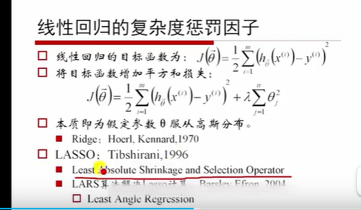

   - LASSO具有降维的性质
   - 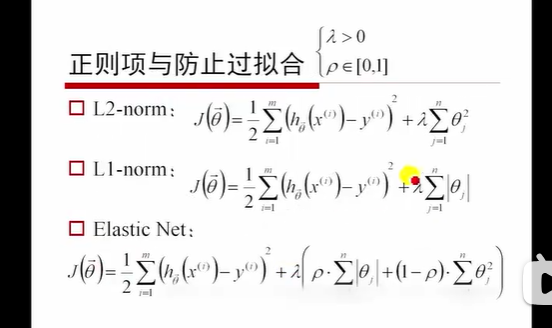
     - Elastic Net：弹性网、

4. RSS（总平方和）和TSS（残差平方和）

   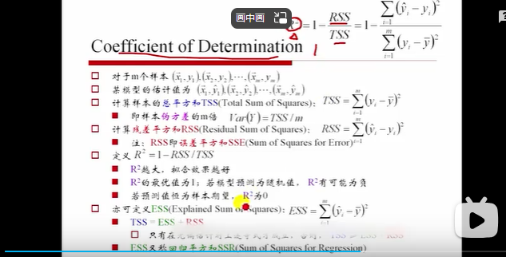

5. 

### 二、梯度下降

1. 找到下降最快的点，然后下去，再次环顾四周，找到下降最快的点。

   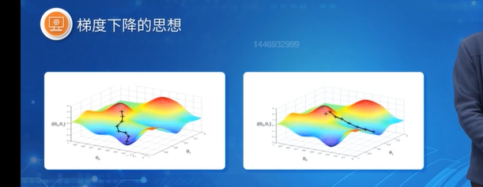

2. 开始的点不同，结果可能不同。
3. 下降的方向就是**梯度**的负方向。

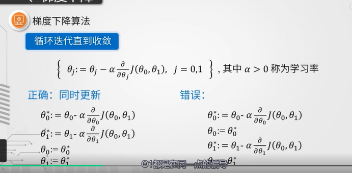

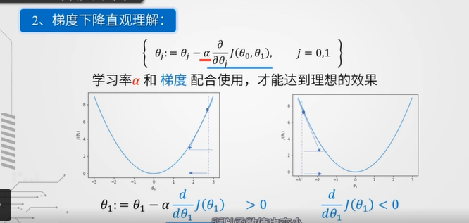

4. $\alpha$作用

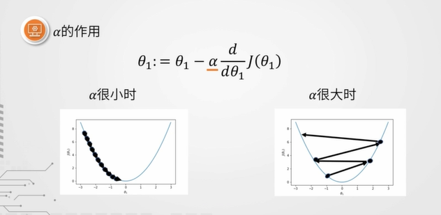

​	$\alpha$很小时，需要迭代很多次，才能够达成目标。

​	$\alpha$很大时，会由于步长太大，冲过了最小值，导致损失函数值越来越大，导致出现发散的状态。

5. 单变量线性回归的梯度下降

   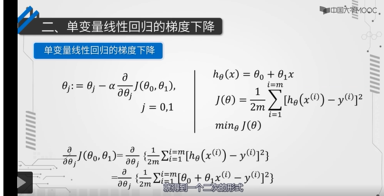

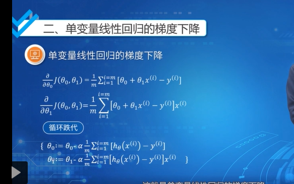

6. 梯度下降优缺点 

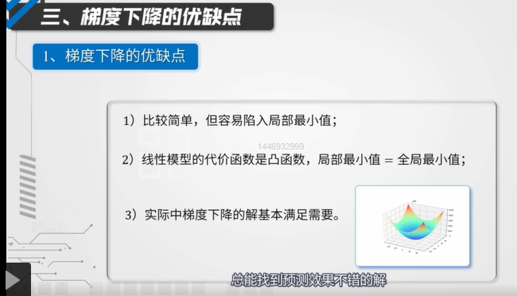

二、多变量线性回归

1. 多变量线性回归

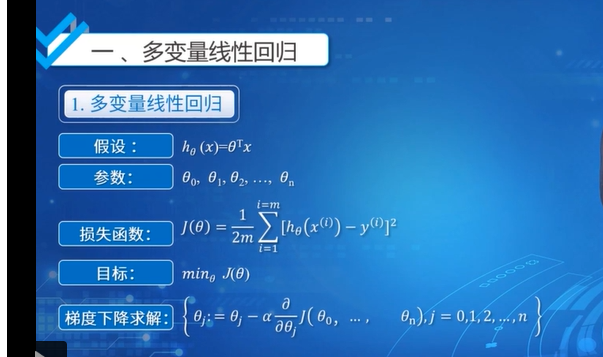

2. 特征标准化方法

   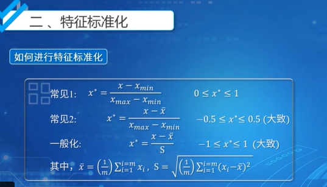

### 三、多项式回归

1. 多变量线性回归正则方程的解

   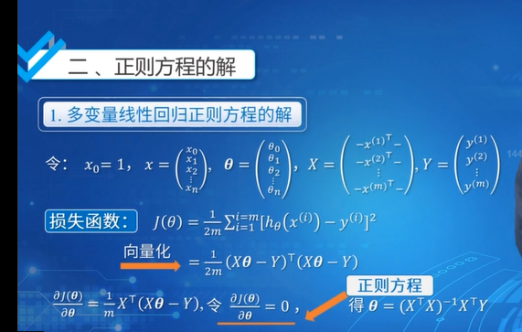

2. $X^TX$不可逆的情形

   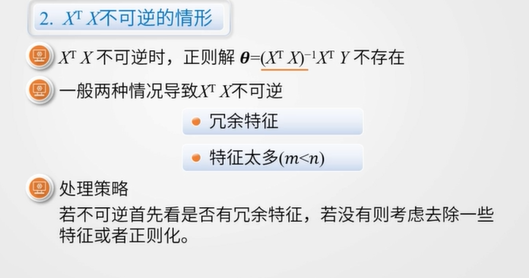

3. 正则方程和梯度下降对比

   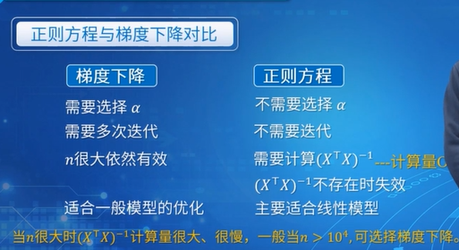